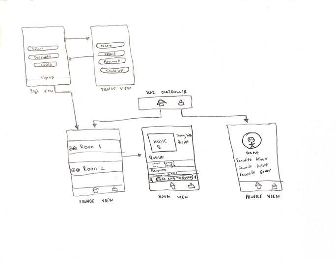
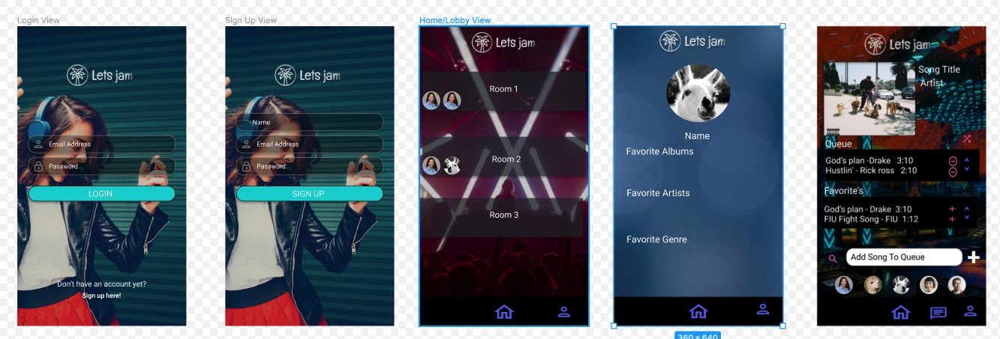

# CodePathTeam
Unit 8: Group Milestone 
===

:::info
**Group Project README**
:::

# LET'S JAM

## Table of Contents
1. [Overview](#Overview)
1. [Product Spec](#Product-Spec)
1. [Wireframes](#Wireframes)

## Overview
### Description
An app that allows users to listen to music together in a room and add music to a queue playlist.

### App Evaluation
- **Category:** Music
- **Mobile:** This app would only be avaliable on mobile devices.
- **Story:** Allows user to come together and listen to music together and share new music. 
- **Market:** Anyone who enjoys listening to music with their friends.
- **Habit:** This app could be used as often as the user has one or more friends wanting to join together and listen to music.
- **Scope:** We would allow users to create a lobby and others will be able to join. This could evolve into sharing other forms of media

## Product Spec
### 1. User Stories (Required and Optional)

**Required Must-have Stories**

* Users will be able to login/register.
* Users will be able to create a room that will allow others to join.
* Users will be able to connect to their spotify.
* A user will be able to control the room.
* Users will be able to add to playlist queue.

**Optional Nice-to-have Stories**

* Users will be able to chat with each other in a room.
* Users can also play Youtube videos in a room.
* Users can like or dislike a song.

### 2. Screen Archetypes

* Login 
* Register - User signs up or logs into their account
   * Upon downloading users will be able to register or login.
* Lobby Screen 
   * Allows users to join a room of their choice.
* Profile Screen 
   * Allows user to upload a photo and fill in favorite music prefernces
* Room Screen
   * Allows users to listen to music and add music to the queue

### 3. Navigation

**Tab Navigation** (Tab to Screen)

* Home
* Profile

Optional:
* Chat
* Settings

**Flow Navigation** (Screen to Screen)
* Forced Log-in -> Account creation if no log in is available
* Lobby Selection -> Jumps to Room
* Room -> Music to be Queued 
* Profile -> Text field to be modified. 

## Wireframes
 

### [BONUS] Digital Wireframes & Mockups

## Schema 
### Models
#### Song

   | Property      | Type     | Description |
   | ------------- | -------- | ------------|
   | songID        | String   | unique id for the user post (default field) |
   | songTitle     | String   | The title of the Strong |
   | songImage     | File     | album image of the song |
   | caption       | String   | image caption by author |
   | commentsCount | Number   | number of comments that has been posted to an image |
   | likesCount    | Number   | number of likes for the post |
   | createdAt     | DateTime | date when post is created (default field) |
   | updatedAt     | DateTime | date when post is last updated (default field) |
